El objetivo de este trabajo es comprender cómo se aplican los estándares de interoperabilidad (en particular, FHIR) en sistemas de salud, con foco en la Red Nacional de Salud Digital de Argentina.

# Actividad 1- Creación de un recurso Patient con HAPI FHIR
Se accedió al servidor de prueba HAPI FHIR en su versión R4 a traves del sitio oficial: https://hapi.fhir.org/baseR4. Desde la interfaz del mismo, se seleccionó el recurso Patient y se utilizo el metodo POST para crear un nuevo paciente. Para ello, se envió el siguiente cuerpo en formato JSON:
    {
    "resourceType": "Patient",
    "name": [
      {
        "use": "official",
        "family": "Scalise",
        "given": ["Zarina"]
      }
    ],
    "gender": "female",
    "birthDate": "2000-01-01"
  }

El servidor respondio con el estado HTTP **201 Created** que indica que el recurso fue creado exitosamente. La URL que se generó para acceder al recurso fue: https://hapi.fhir.org/baseR4/Patient/47884498/_history/1 

El recurso creado incluye los siguientes atributos:
- resourceType: Especifica que se trata de un recurso de tipo Patient.
- id: Identificador único del recurso (47884498).
- name: Contiene el nombre del paciente, con nombre "Zarina" y apellido "Scalise".
- gender: Género declarado como female.
- birthDate: Fecha de nacimiento 2000-01-01.

A continuación, se adjuntan capturas de pantalla del procedimiento realizado para evidenciar el proceso:
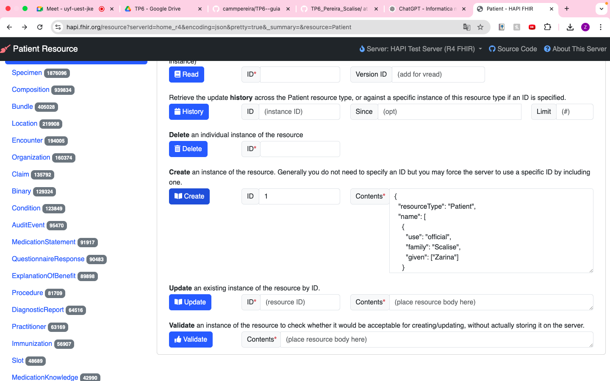
*Figura 1: Actividad 1*

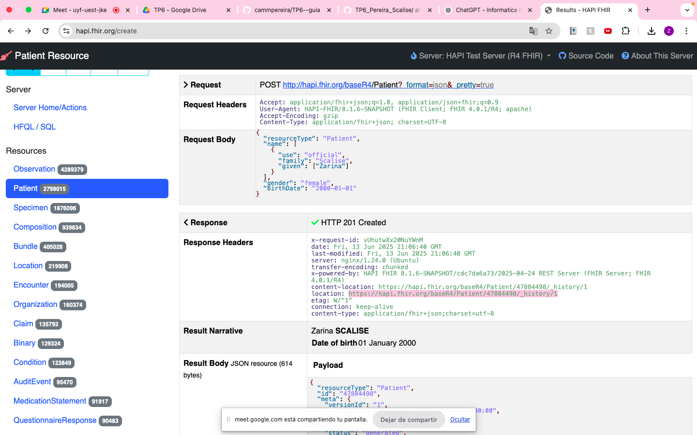
*Figura 2: Actividad 1*

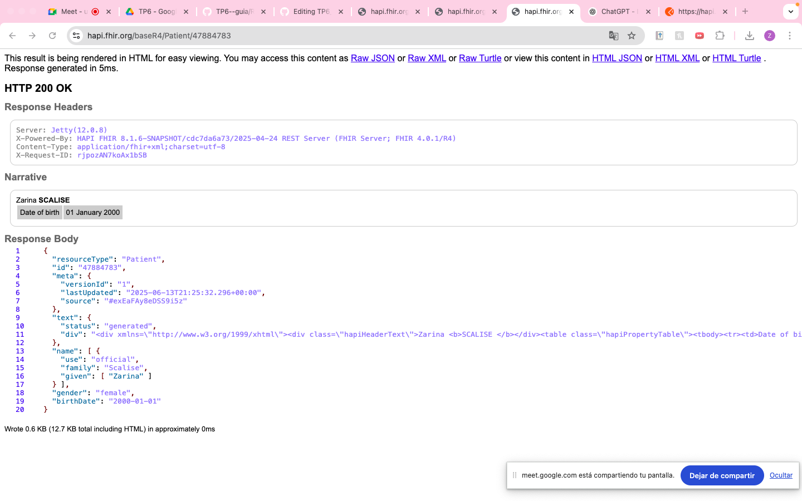
*Figura 3: Actividad 1*

# Actividad 2 - Postman
Se utilizó la herramienta Postman, que permite probar la comunicación entre sistemas a través de solicitudes HTTP. Ahí se envió manualmente el mismo formulario JSON con los datos del paciente al mismo servidor utilizado en la actividad anterior. Después de hacer el POST, se recibió una respuesta con un **201 Created**, el mismo sería una verificación del guardado. 

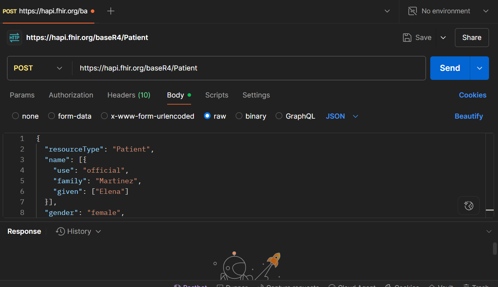
*Figura 1: Actividad 2*
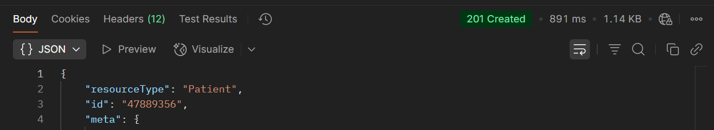
*Figura 2: Actividad 2*
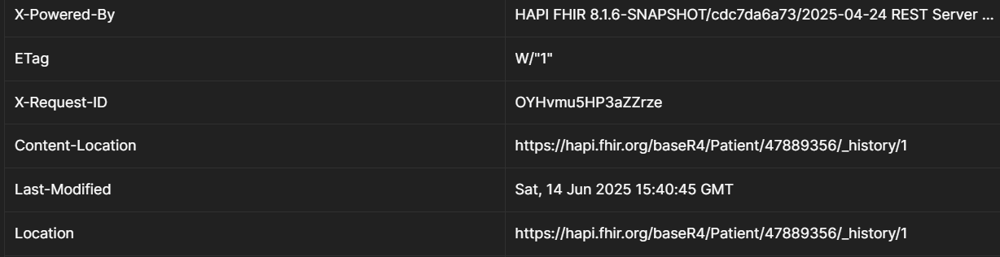
*Figura 3: Actividad 2*
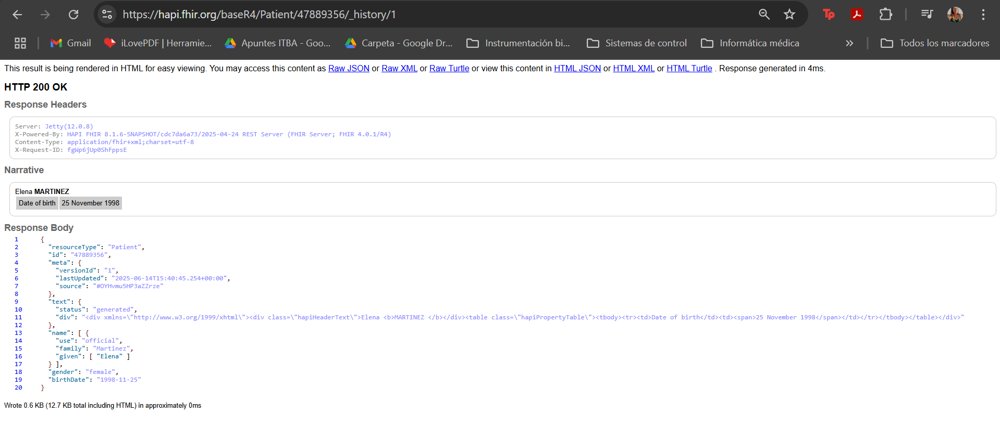
*Figura 4: Actividad 2*

Luego se verificó la existencia mediante un GET, al cual el sistema responde con un **200 OK**, confirmando lo realizado.
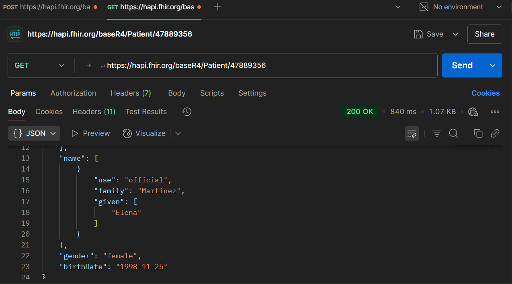
*Figura 5: Actividad 2*

# Actividad 3
En esta actividad se trabajó con el estándar FHIR utilizando Python, implementando recursos clínicos, enviándolos al servidor HAPI FHIR y estableciendo relaciones entre ellos. La actividad se dividió en tres partes:

## 3a. Crear un recurso patient y enviarlos al servidor
Se implementó en Python una función utilizando la libreria ***fhir.resources*** para crear el recurso patient, que incluye nombre, apellido, genero, fecha de nacimiento y numero de documento como identificador.
El recurso fue enviado exitosamente al servidor público HAPI FHIR (https://hapi.fhir.org/baseR4/Patient) utilizando una solicitud HTTP POST. El servidor devolvió un código **201 Created** y un ID asignado, confirmando que el recurso fue almacenado correctamente.

## 3b. Buscar un recurso Patient por número de documento
Se implementó una funcion que realiza una consulta HTTP GET al servidor, utilizando el identificador nacional como parámetro. Esta búsqueda devuelve los recursos Patient que coincidan con ese identificador. 
La consulta fue exitosa y se encontró el paciente que previamente habíamos creado, lo que termina verificando que el recurso fue almacenado correctamente y puede ser recuperable por medios interoperables

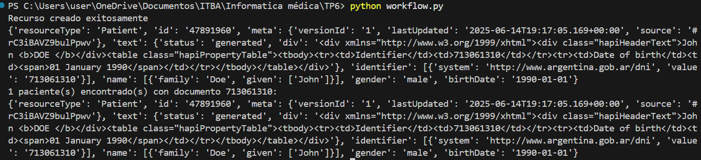
*Figura 6: Actividad 3*
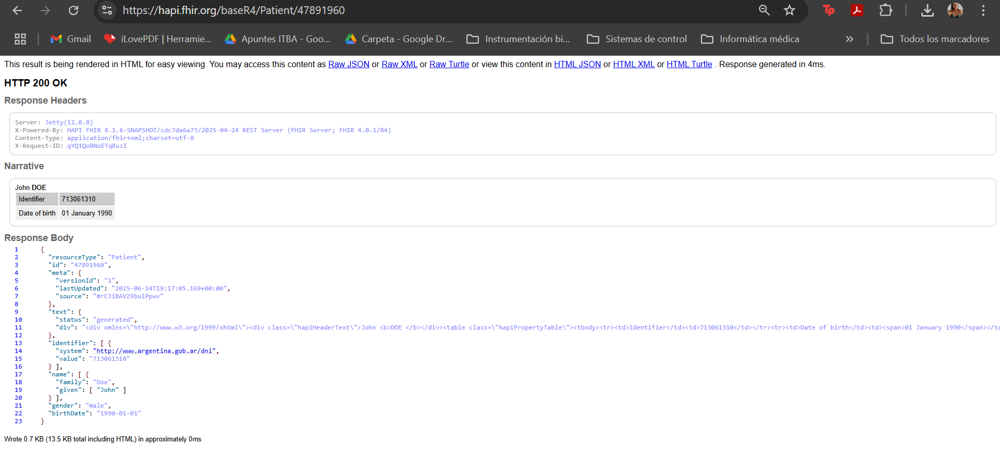
*Figura 7: Actividad 3*

## 3c. Crear un recurso ServiceRequest relacionado con un recurso Observation
Como grupo 3, nos correspondía trabajar con el recurso ServiceRequest, el mismo representan una solicitud clínica (PE: Estudios o tratamientos).
Para establecer una relación con otro recurso, se decidió crear primero un recurso Observation, que documento una observación clínica asociada al mismo paciente. Ambos recursos fueron construidos en Python y enviados al servidor. 
La relación se estableció mediante el campo supportingInfo del recurso ServiceRequest, donde se referenció directamente el ID de la Observation que previamente había sido creado. El servidor termino aceptando ambos recursos, permitiendo posteriormente ver la consulta.

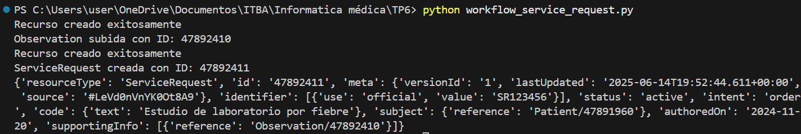
*Figura 8: Actividad 3*
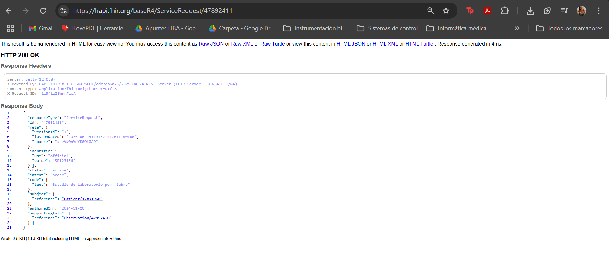
*Figura 9: Actividad 3*
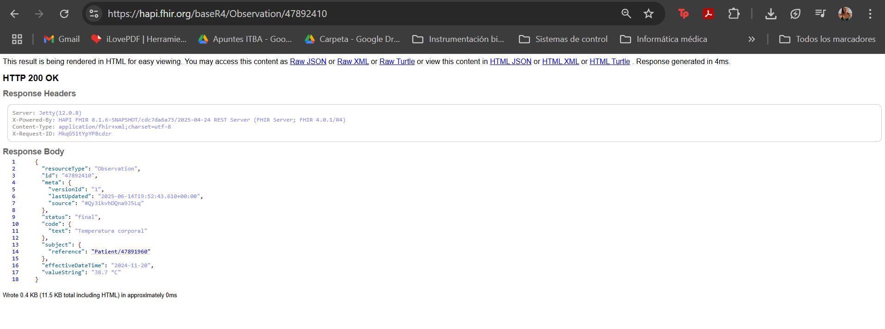
*Figura 10: Actividad 3*
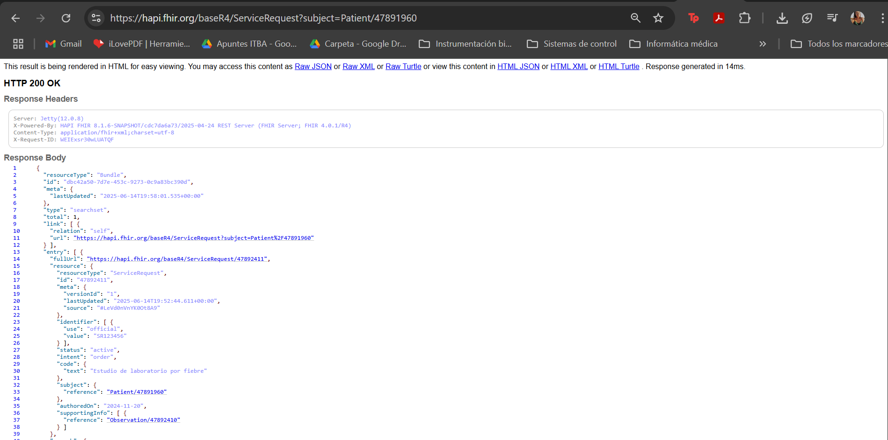
*Figura 11: Actividad 3*

Este trabajo permitió aplicar de forma práctica los conceptos de interoperabilidad en salud mediante la creación, envío y recuperación de recursos FHIR, tanto manualmente como programáticamente. Se logró una mejor comprensión del funcionamiento de los estándares y su implementación en sistemas reales.
